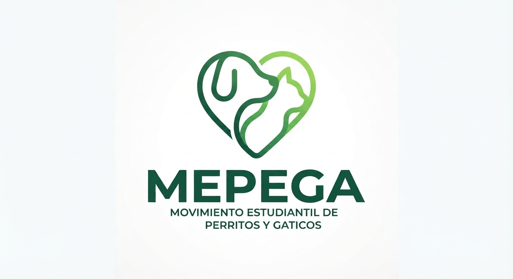

# 3. Nombre del proyecto y detalles

## Gestor de PQRS - Mepega

Sistema de gestión de Peticiones, Quejas, Reclamos y Sugerencias (PQRS) para servicios veterinarios de perros y gatos y otros animales, desarrollado para el curso de Algoritmia y Programación - Universidad de Antioquia.

## 1. Integrantes del equipo

- **Duvan Estiben Granado Alzate** — duvan.granado@udea.edu.co — Ingeniería Industrial
- **Mario Estrada** — mario.estrada2@udea.edu.co — Ingeniería Industrial
- **Samuel González Contreras** — samuel.gonzalez4@udea.edu.co — Ingeniería Industrial
- **Yeison Solar** — y.solar@udea.edu.co — Ingeniería Industrial

## Descripción del proyecto

Programa de consola en Python que permite registrar, consultar y actualizar 
Peticiones, Quejas, Reclamos y Sugerencias (PQRS) relacionadas con la atención 
de perros y gatos, generando radicados y estadísticas de gestión.

## 2. Vínculos académicos y descripción

Todos los integrantes pertenecen al programa de **Ingeniería Industrial**. A continuación, las fortalezas y habilidades de cada uno en el equipo:

* **Duvan Granado Alzate**
* *Fortalezas:* Capacidad analítica para la optimización de procesos lógicos, estructuración de requerimientos técnicos, disposición constante para el trabajo en equipo y manejo en la distribución responsable del tiempo en las metas del proyecto, responsabilidad y paciencia en el desarrollo de los proyectos.
  
* **Mario Estrada**
  * *Fortalezas:* Capacidades en la organización de datos, manejo eficiente de herramientas ofimáticas como Excel, disposición y atención para la solución de problemas algorítmicos y un gran sentido de compañerismo que facilita la integración del grupo junto con la responsabilidad y compromiso con las actividades.
    
* **Samuel González Contreras**
  * *Fortalezas:* Excelente trabajo colaborativo en equipo, diseño de la estructura del código base en Python y enfoque ordenado en el uso responsable del tiempo, capacidades de resolución de problemas dentro y fuera del trabajo junto con la responsabilidad y el trabajo en equipo presente.  

* **Yeison Solar**
  * *Fortalezas:* Rigurosidad en el control de calidad, enfoque en la documentación de los procesos, soporte en la validación de requerimientos y concentración para prestar las mejores soluciones al equipo. 

---
## Estructura del repositorio

- `src/` — Código fuente en Python
- `docs/` — Documentación y manual de usuario
- `images/` — Logo y diagramas de Gantt del proyecto
- `data/` — Archivos planos (Peticion.txt, Queja.txt, Reclamo.txt, Sugerencia.txt, Usuarios.txt)
