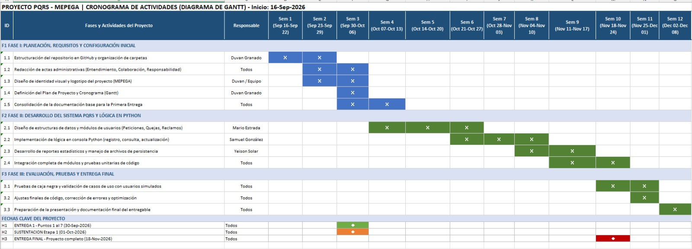

## 4. Plan de Proyecto

### Cronograma de Actividades
Para organizar el trabajo del equipo a lo largo del semestre, dividimos el proyecto en tres fases principales ajustadas al cronograma de 12 semanas:

* **Fase 1 (16 al 18 de septiembre de 2026) — Configuración y Diagnóstico Inicial:**
  * Definición de los objetivos del proyecto, alcance y redacción de las actas de equipo (Entendimiento, Colaboración y Responsabilidad).
  * Creación y configuración inicial del repositorio en GitHub, estableciendo las carpetas clave (`src`, `docs`, `data`, `images`) y los archivos base.
  * Diagnóstico y recolección de información para la gestión de PQRS en MEPEGA.

* **Fase 2 (19 al 24 de septiembre de 2026) — Desarrollo Técnico y Lógica en Python:**
  * Análisis de procesos y oportunidades de mejora en el registro y control de documentos.
  * Diseño y estructuración del código en Python para el menú, autenticación y manejo de archivos planos (`Peticion.txt`, `Queja.txt`, `Reclamo.txt`, `Sugerencia.txt`).
  * Implementación de validaciones robustas (correo, teléfono, documentos y fechas).

* **Fase 3 (25 al 29 de septiembre de 2026) — Documentación y Redacción Final:**
  * Redacción del informe escrito (Visión, Requisitos, Plan de Proyecto y Presupuesto).
  * Revisión general de formato, normas de presentación y consolidación del archivo de Excel del cronograma.
  * Actualización del diagrama de Gantt (`Gantt.png`) en la carpeta de imágenes del repositorio.

* **Fase 4 (30 de septiembre al 01 de octubre de 2026) — Entrega y Sustentación:**
  * **30 de septiembre de 2026:** Entrega formal de los puntos 1 al 7 a través del repositorio de GitHub.
  * **01 de octubre de 2026:** Preparación y sustentación del proyecto ante el docente.

*[Descargar el archivo completo de Excel del Cronograma](../docs/Cronograma%20del%20Proyecto%20PQRS%20MEPEGA%20diagrama%20de%20Gantt.xlsx)*   
---

###7. Presupuesto y Estimación de Costos (Simulación Académica)

Para cumplir con los requerimientos de la asignatura, estimamos un esfuerzo global de **50 horas de trabajo colaborativo**, distribuidas de manera equitativa entre los 4 integrantes del grupo (aproximadamente 12.5 horas por persona), valoradas bajo el marco conceptual de un Salario Mínimo Legal Vigente (SMLV) aplicado a un rol de estudiante en práctica:

* **Duvan Estiben Granado Alzate:** Coordinación del repositorio, control de versiones y documentación inicial (12.5 horas).
* **Mario Garcia:** Desarrollo de la lógica de archivos planos y estructuras de datos (12.5 horas).
* **Samuel González contreras:** Implementación los módulos de control de usuarios y validaciones (12.5 horas).
* **Yeison Solar:** Creación de reportes, estadísticas e integración con Power BI (12.5 horas).
* 
* **Total de esfuerzo en conjunto:** 50 horas invertidas en el proyecto.

#### Conversión Económica y Simulación de Costos

Siguiendo las directrices institucionales y tomando como referencia la jornada máxima legal actual de **43 horas semanales** en Colombia, se realiza la siguiente simulación de costos para el proyecto:

1. **Base de Cálculo por Hora (Practicante):** Tomando el valor del Salario Mínimo Legal Vigente (SMLV) prorrateado a una base mensual estimada sobre la jornada de 43 horas semanales.
2. **Valorización del Esfuerzo:** Al multiplicar el total de horas invertidas por el equipo (**50 horas**) por el valor hora calculado del practicante, se obtiene el valor total simulado del desarrollo del entregable.
3. **Justificación:** Aunque no representa una transacción financiera real al tratarse de un entorno académico, este cálculo matemático evidencia el dimensionamiento de los recursos humanos y el tiempo invertido en la gestión de ingeniería del software.
